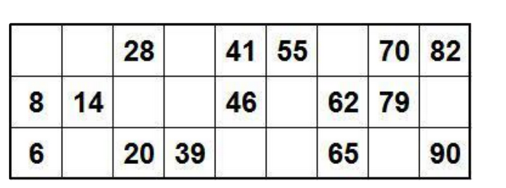

# Задача 1
Исправьте код так, чтобы в результате выполнения функции executeAll([1, 2, 3, 4, 5]) в консоли отобразилось:
```
// 1 Operation 1 complete
// 2 Operation 2 complete
// 3 Operation 3 complete
// 4 Operation 4 complete
// 5 Operation 5 complete
// 6 All operations completed
```
## Решение:
forEach не умеет обрабатывать асинхронные функции.
```
function executeComplexOperation() {
  const randomDelay = Math.floor(Math.random() * (500 - 100 + 1)) + 100;
  return new Promise(resolve => setTimeout(resolve, randomDelay));
}

async function executeAndInform(id) {
  await executeComplexOperation();
  console.log(`Operation ${id} complete`);
}

async function executeAll(array) {
  for (let id in array) {
    await executeAndInform(array[id]);
  }

  console.log('All operations completed!');
}

executeAll([1, 2, 3, 4, 5]);
```

# Задача 2
Данный код создаст массив из котиков. Каждая функция в массиве должна вывести свой порядковый номер, но что то пошло не так
и все кошки говорят, что их номер 10. Почему у всех кошек одинаковые номера? Исправьте код, чтобы он работал как задумано.

## Решение:
Это происходит, потому что на момент вызова ф-и i уже поменялась и она используется одна на всех котов.
 поэтому каждому коту нужна уникальная i.  Поэтому сохраняем  i  в отдельную переменную.
```
function createCats() {
  let cats = [];
  var i = 0;

  while (i < 10) {
    let idCat = i;
    let cat = function() {
      console.log(`My index is ${idCat}`);
    };

    cats.push(cat);
    i++;
  }

  return cats;
}

let animals = createCats();
animals[0]();
animals[5]();
```
так же можно переписать с while на for и объявлять i через let
```
function createCats() {
  let cats = [];

  for (let i = 0; i < 10; i += 1) {
    let cat = function() {
      console.log(`My index is ${i}`);
    };

    cats.push(cat);
  }

  return cats;
}

let animals = createCats();
animals[0]();
animals[5]();
```
# Задача 3
Необходимо найти сумму всех вершин, значение которых кратно 2

## Решение

```
const tree = {
  value: 3,
  children: [
    {
      value: 1,
      children: []
    },
    {
      value: 4,
      children: []
    },
    {
      value: 3,
      children: [
        {
          value: 8,
          children: [
            {
              value: 2,
              children: []
            },
            {
              value: 5,
              children: []
            }
          ]
        },
        {
          value: 0,
          children: []
        }
      ]
    }
  ]
};

function SearchSum(tree) {
  let sum = 0;

  if (tree.value % 2 === 0) {
    sum += tree.value;
  }

  for (let i = 0; i < tree.children.length; i+= 1) {
    sum += SearchSum(tree.children[i])
  }

  return sum;
}
```
# Задача 4
Написать приложение используя React, которое может отрисовывать карточку для игры в лото.

**Требования к интерфейсу:**
1. Внешний вид должен быть аналогичен приложенному изображению
2. Добавить возможность повторной генерации чисел в отрисованной карточке по нажатию кнопки

**Требования для формирования карточки:**
1. Каждая карточка должна содержать уникальный набор чисел от 1 до 90.
2. Всего должно быть 3 ряда и 9 столбцов на каждой карточке.
3. В карточке должны быть заполнены случайным образом 15 чисел (по 5 в каждом ряду) из диапазона от 1 до 90, без повторений в
пределах карточки.
4. Каждый столбец должен содержать числа из определенного диапазона: 1-9 для первого столбца, 10-19 для второго и так далее.



***Опционально**

1. Использовать TypeScript при разработке
2. Вынести карточку и кнопку в отдельный React компонент, который сможет принимать ref, значение которого будет двумерным
массивом сгенерированных чисел

```
[
    [null, null, 28, null, 41, 55, null, 70, 82],
    [8, 14, null, null, 46, null, 62, 79, null],
    [6, null, 20, 39, null, null, 65, null, 90]
]
```
## Решение:
 ссылка на [репозиторий](https://github.com/ZoricmaTs/loto)